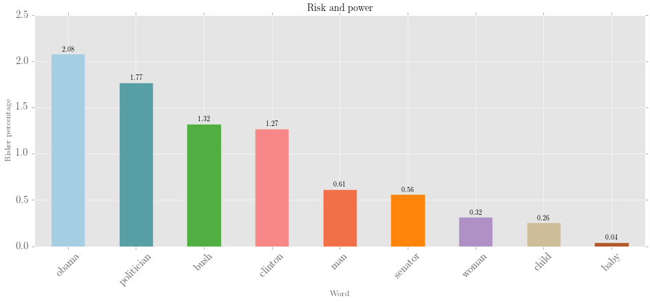



## Selecting data to edit

You can select any interrogation or edited result to edit. After this, you need to select a `branch`, either `results` or `totals`. These correspond to the two spreadsheets in the `Interrogate` tab. Some kinds of searches do not generate both branches, however: `Count tokens`, for example, produces only a totals branch.

## Operations and denominators

A common task is to turn absolute into relative frequencies. To do this, you simply select `'%'` as the operation, and `self`-`totals` as the denominator. To calculate a ratio, you could use '&divide;'.

### Relative frequencies: an example

Perhaps you are interested in the most common plural nouns in each subcorpus of your corpus. Your subcorpora, however, vary quite a lot in size, so you think relative, rather than absolute, frequencies are more appropriate.

You decide you want to get the relative frequency of plural nouns compared to:

1. All plural nouns
2. All nouns
3. All tokens

To do this, you perform three interrogations, all using the `Trees` data type. First, you use `Get words` with a query that will match plural nouns. You give the interrogation a memorable name: `list plural`:

> `/NNP?S/ < __`

Second, you use the `Count tokens` search type, and define a query to match any noun (name: `count noun`):

> `/NN.?/ < __`

Finally, still using the `Count tokens` option, you select the preset query `Any`, which will match any token (name: `count token`).

Now, in the editor pane, you perform three separate edits, creating three different spreadsheets:

| Data     |  Branch    |  Operation    |  Denominator | Branch |   
|----------|-----------:|:--------------:|-------------:|-------:|
| `list plural` |  `results`  |  `%`    |  `Self`/`list plural`      | `totals` |
| `list plural` |  `results`  |  `%`    |  `Count noun`        | `totals` |
| `list plural` |  `results`  |  `%`    |  `Count token`        | `totals` |

Because you can use any result/total as the denominator (provided it has the same subcorpora), you can calculate almost anything in your data. You could use the same general method, with slightly different queries and operations, to:

* Calculate the ratio of nouns to verbs in your corpus, using the division operator
* Calculate the average number of words per sentence
* Subtract use of *Google* as a verb from your existing data, which counted all instances of *Google*
* and so on ...

## Results branch as denominator

If you use a `results` branch as a denominator, things get a little more complex. Rather than being divided by the total from that subcorpus, each entry will be divided by the total occurrences of that particular entry in the denominator data. This is a hard thing to explain, though. It's easier to understand this feature through an actual use-case:

### Calculating risk and power

In an investigation of risk language in *The New York Times*, exploratory analysis suggested that people in positions of power are often the ones doing risking. *Politicians risk votes*, but *shoppers* don't seem to *risk fatigue*. This seems like an interesting thing to measure ... but there is a problem. Some common nouns, like *person*, are much more frequent than *Obama* or *senator*. So, if we try to tally all riskers, *person* comes out on top.

To work around this, the investigator performs two searches. The first counts all *Participants* in the corpus. The second counts all the *Participants* who are the actors in risk processes:

| # | Data type    | Search option | Query | Function filter | Lemmatise  | Name
|:---:|:--------------:|:---------------:|:-------:|:-----------------:|:------------:|:-----:|
| 1 | `Dependencies` | `Get tokens by role` | `LIST:PARTICIPANT` | | `True` | `participants` | 
| 2 | `Dependencies` | `Get "role:dependent"` | `\brisk.*` | `LIST:ACTOR` | `True` | `riskers` |

We also head to the `Wordlists` feature and define a list of people of interest, called `PEOP`:

>    `obama`

>    `bush`

>    `clinton`

>    `politican`

>    `senator`

>    `man`

>    `woman`

>    `child`

>    `baby`

The two lists can then be mashed together:

| Data |  Branch    |  Operation    |  Denominator | Branch | Sort | Just totals | Just entries | 
|:----------:|:-----------:|:--------------:|:-------------:|:-------:|:-------:|:-----:|:------:|
| `riskers` |  `results`  |  `%`    |  `participants`      | `results` |  `Total` | `True` | `LIST:PEOP` |

The visualised output:

<a href="images/risk-and-power-2.png" > 

</a>

... Great! As expected, though *person* might be a much more common word than *politician*, politicans are far more likely to be doing risking.

## Combining results

You can use the `combine` operation to add two results together. By default, this happens on the y axis. If you have multiple columns with the same names, results may be merged. If you want to merge on the x-axis, use the `Transpose` option for each dataset, and then `combine`.

## Sorting

When working with multiple subcorpora, sorting becomes a very powerful feature of *corpkit*. Aside from very normal kinds of sorting (by total, by name), you can also sort by *increase*, *decrease*, *static* or *turbulent*. 

*corpkit* does this using [`Scipy`'s *linear regression* function](http://docs.scipy.org/doc/scipy-0.14.0/reference/generated/scipy.stats.linregress.html). Essentially, a straight trend line is calculated for each entry in the data. By measuring the angle of this line, we can find out which results increasingly or decreasingly occur across the dataset.

If you tick `Keep stats`, you'll be able to see the `slope`, `intercept`, `stderr` and `p value`, where the null hypothesis is that there is no upward or downward slope. `Remove above p` will automatically exclude results not meeting the standard.

## Keywording

If you select the `keywords` operation, you can get log-likelihood keyness scores for the the dataset of interest, compared with the denominator as a reference corpus. When doing keywording, the reference corpus can be: 

1. a results branch of any interrogation
2. A dictionary from the `dictionaries` folder: either the BNC (included), or one you made yourself using the `Save as dictionary` button in the `Interrogate` tab.

Using `Self`-`results` as denominator will determine which words are key in each subcorpus. Each subcorpus is dropped from the reference corpus in turn in order to calculate these values.

{{tip}} Negative keywords exist, too: try sorting by inverse total to find out which words are uncommon in the target data. {{end}}

You can also use `%-diff` to calculate keywords via percentage difference, an alternative keyword algorithm.

## Skipping, keeping, merging

You can easily skip, keep or merge particular entries and subcorpora. For entries, you need to to write out some criteria. For subcorpora, you can select from the list.

When writing out entries to keep/remove/merge, you can supply either:

1. A regular expression to match: `^fr*iends?$` will match `fiend`, `fiends`, `friend` and `friends`.
2. A list: `[fiend,fiends,friend,friends]`

{{note}} Special queries work here, too. If you searched for process, you could keep only verbal processes by using <code>LIST:VERBAL</code>. {{end}}

If merging either subcorpora or entries, you may want to provide a new name for the merged item. If you leave this field blank, the first few entry names are joined together with slashes as the new name.

Merging entries is a powerful way to do thematic categorisation: you could merge the names of illnesses as `Illnesses`, and the names of treatments as `Treatments`. You could then edit the edited results, keeping only those two.

## Replacing names

You can change the names of entries after they appear. One way to do this is to click the spreadsheet, make changes, and click `Update interrogation(s)`. Another way is to use the `Replace names` boxes. The box on the left takes a regular expression as a search pattern. It will look in every entry name matching the expression, and replace it with whatever is in the box on the right (leave blank to simply delete the found pattern). Duplicate entry names are then merged.

## Other options

| Option  | Function  |
|---|---|
| `Keep stats`  | When calculating slopes, keep these in the edited data, and show them in the spreadsheet windows  |
| `Remove above p`  | A null hypothesis is that entries are equally frequent in each subcorpus. When calculating slopes, remove any entries with `p` above `0.05`   |
| `Just totals`  | Combine every entry before processing |
| `Transpose`  | Flip rows and columns (subcorpora become entries, etc.)  |
| `Spelling` | Convert or normalise English | 
| `Keep top results` | After all other editing and sorting, return only the top n results | 

## Naming your edit

As with interrogations, it might be helpful to give your edit a name, so that it can be more easily identified. You don't have to do this, however.

## Performing an edit

Once all your options are set, just hit `Edit`. 

Editing is generally very fast, but very large interrogations, combined with many different kinds of edits, may slow things down a bit. Using results, rather than totals, as a denominator will generally take a little longer.

{{note}} You can use <code>Help</code> &rarr; <code>Save log</code> after performing an edit to get some information about what was performed. {{end}}

If you'd like to see the results in a bigger window, head back to the `Interrogate` tab and use the `Previous` and `Next` buttons to bring up your edited results.

## Next steps

After you've created a set meaningful results, you can head over to the `Visualise` tab to display your findings in an engaging way.
