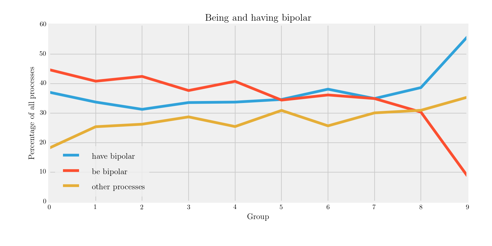
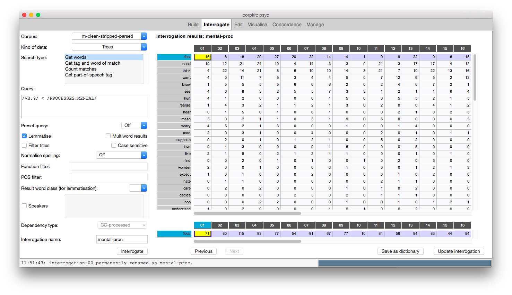
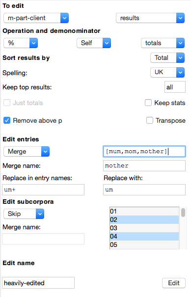
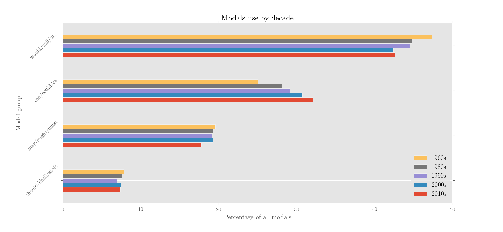
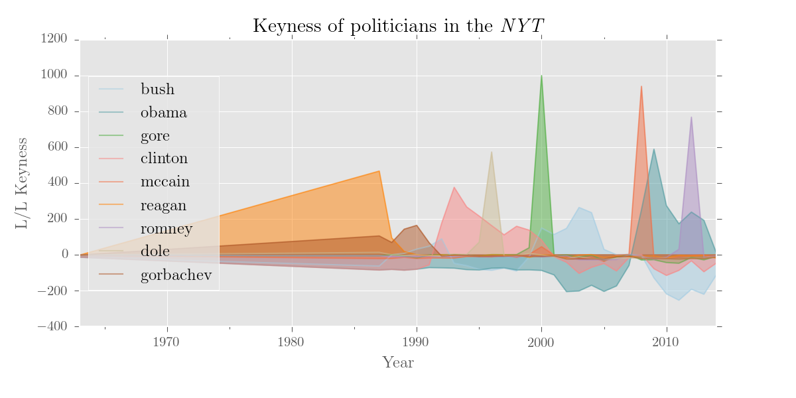
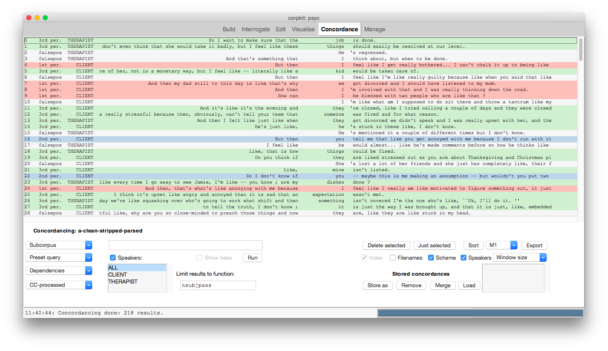



#### Parsing

*corpkit* helps you parse texts, without needing to go the command line. Just load in a folder containing text files or subfolders of text files, then hit `Parse`!

#### Speaker IDs

*corpkit* can recognise speaker IDs when parsing, and restrict searches to particular speakers. All you need to do is format your data like a transcript:

    PROSECUTOR: Good afternoon.
    PRESIDENT: Good afternoon.
    PROSECUTOR: Could you please state your full name for the record, sir?
    PRESIDENT: William Jefferson Clinton.

... and *corpkit* will figure out the rest!

#### Search lexis and grammar

*corpkit* allows you to search for both lexical and grammatical features, either separately or together. You can use a regular expression to match both words and the functions of words, answering questions like:

* *What grammatical roles do a particular term of interest generally take?*
* *When the VP is headed by verb x, what is its subject?*
* *What are the most common participants in the corpus, and how are they modified?*

You can use also use *Tregex* to define very complex queries, like the one below, which matches `harm` in `person at the risk of serious harm`:

    /NN.?/ >># (NP > (PP <<# /(?i)of/ > (NP <<# (/NN.?/ < /(?i).?\brisk.?/))))
    Head of noun phrase in PP headed by 'of' in a noun phrase headed by 'risk'

The example below shows how members of an online support group increasingly prefer *having bipolar* constructions to *being bipolar* constructions:

<a href="images/being-and-having-bipolar-538.png" >

</a>

It was made in three simple steps:

1. Searching for predicators when the subject is human pronominal and the complement is headed by *bipolar*, using automatic lemmatisation to collapse verb forms
2. Merging every result aside from *be* and *have* as *Other processes*
3. Plotting the three remaining results as a line chart, with *fivethirtyeight* style.

#### Coreference resolution

Unlike other corpus linguistic tools, *corpkit* makes it possible to search for words alongside their coreferents. In a text that looks like this:

    Here's my iguana. She loves company!

You may want to automatically determine that it is the iguana who loves company. By parsing the texts with the `Referent tracking` option, and by switching on `Count coreferents` during interrogation, you could search for `iguana`, returning `governor lemma`, and get `love` in the results!

#### Dedicated visualisation tools

*corpkit* leverages *pandas*, *matplotlib* and *TeX* to generate high-quality visualisations of linguistic data. You can choose colourmaps, plot types, styles, labels, and much more. Every visualisation shown on this site was made with *corpkit*. That said, you can also export your data easily to CSV files, which can be loaded painlessly into Excel.

#### Wordlists

You can also build custom wordlists that can be added into more complex searches. Via the `Wordlists` menu item, you can quickly define `ANIMALS` as `cat, dog, bird, wolf, (etc.)`, and then search for animals as clausal subjects with:

    @NP <<# /LIST:ANIMALS/

The wordlists tool can automatically retrieve inflection forms for you, as well. These lists can be easily edited or saved.

#### Functional queries

There are preset queries to match mood types, process types, heads of participants, and so on. You can also use pre-defined wordlists to search for certain kinds of functional information, such as *mental verbs*:

    /VB.?/ < /LIST:MENTAL/

#### Compare subcorpora

*corpkit* is designed to work with structured corpora (those containing subfolders). So, not only can you search for nuanced patterns in the text, but you can quickly find out how they vary in frequency by subcorpus.

<a href="images/mental-proc.png" > 

</a>

#### Sophisticated editing of results

The `Edit` tab provides a rane of possibilities for transforming interrogation results:

You can quickly remove, keep or merge entries or subcorpora. In the figure below, kinds of modals are collapsed, and annual subcorpora are collapsed into decades:

<a href="images/modals-use-by-decade.png" > 

</a>

#### Controlled keywording

Keywording works better when you compare subcorpora to a corpus, rather than a corpus to a reference corpus. It also produces more engaging results if you isolate a particular word class or grammatical position. Here's a visualisation of US politicians' names as log-likelihood keywords in the NYT:

<a href="images/keyness-of-politicians-in-the-emphnyt.png" > 

</a>

#### Concordance grammatically

You can concordance using Tregex queries or dependency roles, rather than a simple regular expression search of the text. There are also preset queries for concordancing of particular moods (imperative, interrogate, (modalised) declarative), process types (relational, mental, verbal).

#### Annotate concordances

You can quickly highlight concordance lines, add tags, sort by tag, and export these tags alongside your data. In the example below, passive constructions in a clinical encounter have been concordanced and coloured by person. Speaker IDs are also shown.

<a href="images/conc-passives.png" >

</a>

#### Store everything

Every interrogation is stored in memory, alongside all options used to generate the result. You can save these to disk and auto-load them when you open a project. Concordances can be stored, saved, merged and loaded too. This means that you can always reproduce a particular interrogation. 

You can even share your project with others: if you share the project folder with your colleagues, they can use *corpkit* to explore your saved interrogations, concordances and images.

#### Command line interface

*corpkit* has a lot of functionality, and could probably keep you busy for a long time. If you ever find that the tools aren't intuitive, it is useful to remember that the major functions at work in the interface can also be called via the command line. Generally speaking, command line operation makes it possible to do far more complicated things with your data.

* When interrogating, you can quickly make lists of corpora or queries and perform each simultaneously. 
* When editing, you can create lists of entries to rename or merge, and iterate over them.
* When plotting, you can generate HTML based visuals that are clickable, highlightable, embeddable, and so on.
* You could also be quite recursive, and automatically generate concordance lines for the most key and unkey keywords in every subcorpus.

Command line operation of *corpkit* is presented in more detail at the [*corpkit GitHub repostitory*](https://www.github.com/interrogator/corpkit).

#### Open source

Finally, *corpkit* is free and open source! It's yours to do with as you please.