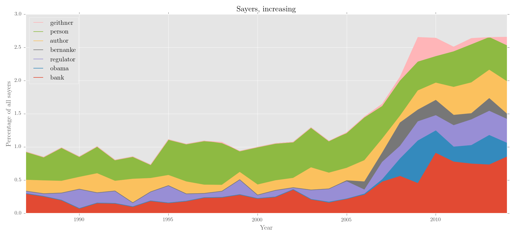

.. corpkit documentation master file, created by
   sphinx-quickstart on Thu Nov  5 11:43:02 2015.
   You can adapt this file completely to your liking, but it should at least
   contain the root `toctree` directive.

========================================
corpkit documentation
========================================

*corpkit* is a Python-based tool for doing more sophisticated corpus linguistics. It exists as a graphical interface, a Python API, and a natural language interpreter. The API and interpreter are documented here.

*corpkit* does a lot of the usual things, like parsing, interrogating, concordancing and keywording, but also extends their potential significantly: you can create structured corpora with speaker ID labels, and easily restrict searches to individual speakers, subcorpora or groups of files. 

You can interrogate parse trees, CoreNLP dependencies, lists of tokens or plain text for combinations of lexical and grammatical features. Results can be quickly edited, sorted and visualised in complex ways, saved and loaded within projects, or exported to formats that can be handled by other tools.

Concordancing is extended to allow the user to query and display grammatical features alongside tokens. Keywording can be restricted to certain word classes or positions within the clause. If your corpus contains multiple documents or subcorpora, you can identify keywords in each, compared to the corpus as a whole.

*corpkit* leverages `Stanford CoreNLP`_, NLTK_ and pattern_ for the linguistic heavy lifting, and pandas_ and matplotlib_ for storing, editing and visualising interrogation results. Multiprocessing is available via joblib_, and Python 2 and 3 are both supported.

.. rubric:: API example

Here's a basic workflow, using a corpus of news articles published between 1987 and 2014, structured like this:

.. code-block:: none
   
   ./data/NYT:

   ├───1987
   │   ├───NYT-1987-01-01-01.txt
   │   ├───NYT-1987-01-02-01.txt
   │   ...
   │
   ├───1988
   │   ├───NYT-1988-01-01-01.txt
   │   ├───NYT-1988-01-02-01.txt
   │   ...
   ...

Below, this corpus is made into a `Corpus` object, parsed with *Stanford CoreNLP*, and interrogated for a lexicogrammatical feature. Absolute frequencies are turned into relative frequencies, and results sorted by trajectory. The edited data is then plotted.

.. code-block:: python

   >>> from corpkit import *
   >>> from corpkit.dictionaries import processes
   
   ### parse corpus of NYT articles containing annual subcorpora
   >>> unparsed = Corpus('data/NYT')
   >>> parsed = unparsed.parse()
   
   ### query: nominal nsubjs that have verbal process as governor lemma
   >>> crit = {F: r'^nsubj$',
   ...         GL: processes.verbal.lemmata,
   ...         P: r'^N'}

   ### interrogate corpus, outputting lemma forms
   >>> sayers = parsed.interrogate(crit, show=L)
   >>> sayers.quickview(10)

      0: official    (n=4348)
      1: expert      (n=2057)
      2: analyst     (n=1369)
      3: report      (n=1103)
      4: company     (n=1070)
      5: which       (n=1043)
      6: researcher  (n=987)
      7: study       (n=901)
      8: critic      (n=826)
      9: person      (n=802)

   ### get relative frequency and sort by increasing
   >>> rel_say = sayers.edit('%', SELF, sort_by='increase')

   ### plot via matplotlib, using tex if possible
   >>> rel_say.visualise('Sayers, increasing', kind='area',
   ...                   y_label='Percentage of all sayers')

Output:

.. rubric:: Installation

Via pip:

.. code-block:: bash

   $ pip install corpkit

via Git:

.. code-block:: bash

   $ git clone https://www.github.com/interrogator/corpkit
   $ cd corpkit
   $ python setup.py install

Parsing and interrogation of parse trees will also require *Stanford CoreNLP*. *corpkit* can download and install it for you automatically.

.. rubric:: Graphical interface

Much of corpkit's command line functionality is also available in the *corpkit GUI*. After installation, it can be started from the command line with:

.. code-block:: bash

   $ python -m corpkit.gui

If you're working on a project from within Python, you can open it graphically with:

.. code-block:: python

   >>> from corpkit import gui
   >>> gui()

Alternatively, the GUI is available (alongside documentation) as a standalone OSX app here_.

.. rubric:: Interpreter

*corpkt* also has its own interpreter, a bit like CQP, but with more features. You can open it with:

.. code-block:: bash

   $ corpkit
   # or, alternatively:
   $ python -m corpkit.env

And then start working with natural language commands:

.. code-block:: bash

   > set junglebook as corpus
   > parse junglebook with outname as jb
   > set jb as corpus
   > search corpus for governor-lemma matching processes:verbal showing pos and lemma
   > calculate result as percentage of self
   > plot result as line chart with title as 'Example figure'

Information about the syntax is available at the :ref:`interpreter-page`.

.. toctree::
   :maxdepth: 1
   :caption: API

   rst_docs/corpkit.building.rst
   rst_docs/corpkit.interrogating.rst
   rst_docs/corpkit.concordancing.rst
   rst_docs/corpkit.editing.rst
   rst_docs/corpkit.visualising.rst
   rst_docs/corpkit.langmodel.rst
   rst_docs/corpkit.managing.rst
   
.. toctree::
   :maxdepth: 2
   :caption: Interpreter

   rst_docs/corpkit.interpreter.overview.rst
   rst_docs/corpkit.interpreter.setup.rst
   rst_docs/corpkit.interpreter.making.rst
   rst_docs/corpkit.interpreter.interrogating.rst
   rst_docs/corpkit.interpreter.concordancing.rst
   rst_docs/corpkit.interpreter.editing.rst
   rst_docs/corpkit.interpreter.visualising.rst
   rst_docs/corpkit.interpreter.managing.rst

.. toctree::
   :maxdepth: 2
   :caption: API reference

   rst_docs/corpkit.corpus.rst
   rst_docs/corpkit.interrogation.rst
   rst_docs/corpkit.other.rst
   rst_docs/corpkit.dictionaries.rst

.. toctree::
   :maxdepth: 2
   :caption: Other
   :hidden:

   Graphical interface <http://interrogator.github.io/corpkit>
   GitHub <https://github.com/interrogator/corpkit>
   rst_docs/corpkit.about.rst

.. rubric:: Cite

If you'd like to cite *corpkit*, you can use:

.. code-block:: none

   McDonald, D. (2015). corpkit: a toolkit for corpus linguistics. Retrieved from
   https://www.github.com/interrogator/corpkit. DOI: http://doi.org/10.5281/zenodo.28361

.. _Stanford CoreNLP: http://stanfordnlp.github.io/CoreNLP/
.. _NLTK: http://www.nltk.org/
.. _pandas: http://pandas.pydata.org/
.. _here: http://interrogator.github.io/corpkit/
.. _pattern: http://www.clips.ua.ac.be/pages/pattern-en/
.. _matplotlib: http://matplotlib.org/
.. _joblib: http://pythonhosted.org/joblib/
